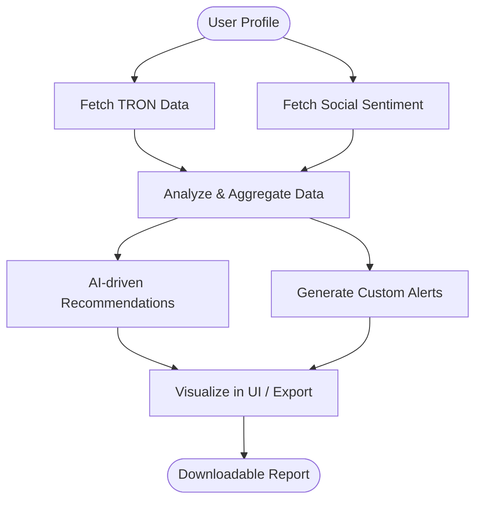

# NAME:
# TronInsight 🌐 — Automated Market & Sentiment Analyzer for TRON Ecosystem

Boost Your Strategic Edge In Tron Crypto Trading! 🔍  
**DESCRIPTION:**  
TronInsight is your intelligent companion for analyzing TRON (TRX) token markets. Our advanced bot combines real-time TRON market volume monitoring with cutting-edge sentiment analysis, powered by OpenAI and Claude API integrations. Whether you’re a developer, trader, or project owner, get actionable insights to make informed decisions, deepen your research, and elevate your TRON journey with automation and clarity.

---

---

## 🚀 Table of Contents
- [Introduction](#introduction)
- [🚦 Feature List](#-feature-list)
- [🌍 OS Compatibility Table](#-os-compatibility-table)
- [🔮 Example Profile Configuration](#-example-profile-configuration)
- [👾 Example Console Invocation](#-example-console-invocation)
- [🗺️ Automated Analysis Workflow (Mermaid Diagram)](#-automated-analysis-workflow-mermaid-diagram)
- [🤖 OpenAI & Claude API Integration](#-openai--claude-api-integration)
- [🌐 Multilingual & Responsive UI](#-multilingual--responsive-ui)
- [🤝 24/7 Customer Support](#-247-customer-support)
- [⚖️ License](#-license)
- [🚨 Disclaimer](#-disclaimer)
- [✨ Download](#-download)

---

## Introduction

TronInsight isn’t just another TRON bot—the platform is inspired by the heartbeat of crypto markets and tuned for the future of automation. Empowered by natural language APIs and actionable dashboards, TronInsight deciphers on-chain volume, exchange liquidity, and social media buzz to provide clarity, trends, and signals in your TRON token analysis.

_Driven by a vision of smarter trading through intelligent automation, TronInsight becomes your daily navigator in the fast world of blockchain assets. With SEO-friendly architecture, adaptable UX, and always-on support, you’ll never trade blind._

---

## 🚦 Feature List

- **Real-Time TRON Token Volume Analytics**  
   Continuous scanning of on-chain and centralized exchange data for TRX and related tokens.
- **Sentiment Analysis with OpenAI & Claude APIs**  
   Uncover unique social signals from Twitter, Reddit, and forums, giving an edge in crypto market sentiment.
- **Responsive Web UI 🔎**  
   Analyze, compare, and visualize insights on any device—desktop, mobile, or tablet.
- **Multilingual Support 🌎**  
   Available in 12+ languages for a global trading community.
- **Custom Profile Management 🧩**  
   Save watchlists, alarms, and personal preferences for a tailored experience.
- **Downloadable Reports 📊**  
   Export detailed trends and charts in CSV or PDF format.
- **SEO-Optimized Public Dashboards**  
   Shareable analytics profiles help boost your token’s organic search presence.
- **Automated Alerts & Recommendations**  
   Stay ahead of market changes with smart notifications and actionable tips.
- **24/7 Live Customer Support 💬**  
   Connect via in-app chat or email—real humans, not just bots!
- **Security-First, Privacy-Respecting Architecture 🔒**  
   Your API keys and analysis history stay safely encrypted.
- **MIT Licensed**  
   Use, adapt, or grow—code for your own projects backed by a respected license.

---

## 🌍 OS Compatibility Table

| Platform    | CLI Bot | Web Dashboard | Downloads |
|:------------|:-------:|:-------------:|:---------:|
|    | ✅   | ✅         | ✅      |
|         | ✅   | ✅         | ✅      |
|   | ✅   | ✅         | ✅      |
|  | 🚧   | ✅         | ✅      |
|            | 🚧   | ✅         | ✅      |

_“🚧” = Partial, work-in-progress mobile CLI (full dashboard support already available)._

---

## 🔮 Example Profile Configuration

To get started, create a profile configuration file (e.g., `myprofile.troninsight.json`):

{
  "api_keys": {
      "openai": "sk-XXXXX",
      "claude": "sk-XXXXX"
  },
  "watchlist": [
      "Tether USDT-TRC20",
      "Sun Token SUN",
      "JUST JST"
  ],
  "alert_thresholds": {
      "volume_spike": 35,     // Alert if 1h volume spikes by 35%+
      "sentiment_drop": -0.4  // Alert if sentiment index drops below -0.4
  },
  "language": "en",
  "report_export": ["csv", "pdf"]
}

## 👾 Example Console Invocation

To launch TronInsight in CLI mode on your machine:

troninsight analyze --profile ./myprofile.troninsight.json --export summary.pdf --alerts enable

Output Sample:

Analyzing 3 tokens...
[TRX] 24h Volume: 2,190,004,450 | Sentiment: 👍 (score: 0.76) | Status: Bullish
[SUN] 24h Volume: 77,120,002 | Sentiment: 👎 (score: -0.21) | Status: Bearish
[JST] 24h Volume: 8,771,000 | Sentiment: 😐 (score: 0.13) | Status: Stable

---

## 🗺️ Automated Analysis Workflow (Mermaid Diagram)

---

## 🤖 OpenAI & Claude API Integration

Leverage high-powered machine learning for advanced sentiment and context analysis:
- **Seamless Setup:** Easily plug in your OpenAI or Claude API keys.
- **Custom Prompts:** Fine-tune how social buzz, news, and posts get interpreted for TRON & related coins.
- **Unlock Deeper Meaning:** Move beyond surface-level data—get nuanced analysis and predictive indicators for the modern crypto market.

---

## 🌐 Multilingual & Responsive UI

- **Languages:** Support for English, Chinese (简体中文), Spanish (Español), Portuguese (Português), Russian (Русский), Turkish (Türkçe), French (Français), German (Deutsch), Korean (한국어), Japanese (日本語), Italian (Italiano), Hindi (हिंदी), and more!
- **Device Ready:** Powered by a dynamic UI, so you stay in control—phone, tablet, or desktop.
- **Accessibility-First:** Carefully crafted for low-vision traders and keyboard navigation.

---

## 🤝 24/7 Customer Support

- **Live In-App Chat:** Reach a support specialist around the clock.
- **Community Discord & Telegram Groups:** Share ideas, request features, and troubleshoot.
- **Comprehensive FAQ & Tutorials:** Learn, share, and master TronInsight at your own tempo.

---

## ⚖️ License

- **MIT License © 2026**
- Use, fork, and contribute with confidence! See the LICENSE file:  
  [MIT License](https://opensource.org/licenses/MIT)

---

## 🚨 Disclaimer

TronInsight is an open-source analytics tool empowered by third-party APIs.  
It does not provide financial advice or trading recommendations. Please verify all insights before making investment decisions or executing trades.  
Crypto trading carries inherent risks. Use at your own discretion and always respect the laws and regulations of your jurisdiction.

---

## ✨ Download

- Get the latest release:
  

---

_© 2026 TronInsight. Built for the bold, by the bold._